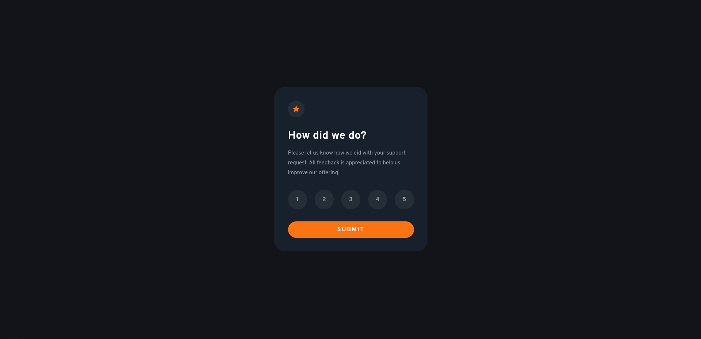

# Frontend Mentor - Interactive rating component solution

This is a solution to the [Interactive rating component challenge on Frontend Mentor](https://www.frontendmentor.io/challenges/interactive-rating-component-koxpeBUmI). Frontend Mentor challenges help you improve your coding skills by building realistic projects. 

## Table of contents

- [Overview](#overview)
  - [The challenge](#the-challenge)
  - [Screenshot](#screenshot)
  - [Links](#links)
- [My process](#my-process)
  - [Built with](#built-with)
  - [What I learned](#what-i-learned)
  - [Useful resources](#useful-resources)
- [Author](#author)

## Overview

### The challenge

Users should be able to:

- View the optimal layout for the app depending on their device's screen size
- See hover states for all interactive elements on the page
- Select and submit a number rating
- See the "Thank you" card state after submitting a rating

### Screenshot



### Links

- Solution URL: [Add solution URL here](https://your-solution-url.com)
- Live Site URL: [Add live site URL here](https://your-live-site-url.com)

## My process

### Built with

- Semantic HTML5 markup
- CSS custom properties (SCSS)
- Flexbox
- JS (addEventListener)

**Note: These are just examples. Delete this note and replace the list above with your own choices**

### What I learned

I learn about JavaScript for the click management and selections.

```js
let ratingButtons = document.querySelectorAll(".rate");
let ratingButtonsArray = Array.prototype.slice.call(ratingButtons);

var selectedRate;

ratingButtonsArray.forEach((rate) => {

    // Add event listener for all rates.
    // When clicked remove all the selected-sate rate and add it fore the one clicked.
    rate.addEventListener("click", () => {

        ratingButtonsArray.forEach((rate) => {
            rate.classList.remove("selected")
        })
        rate.classList.add("selected")
        selectedRate = rate.id;
        console.log(`Rate selected : ${selectedRate}`)
    })

})
```

### Useful resources

- [addEventListener on class](https://stackoverflow.com/questions/54724029/addeventlistener-on-class) - This helped me for understand how use `addEventListener on class.

## Author

- Frontend Mentor - [@FortisCodis](https://www.frontendmentor.io/profile/FortisCodis)
